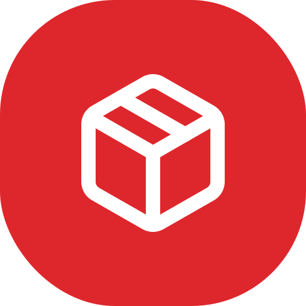

<p align="right"><a href="README.md">English</a></p>

<div align="center">



# Packman

**為機器人團隊打造的競賽行李管理系統。**

[](https://github.com/SeanChangX/packman) [](https://opensource.org/licenses/MIT) [](https://github.com/SeanChangX/packman/actions/workflows/build-and-push.yml)

<table>
<tr>
<td width="50%" align="center"><br><strong>儀表板</strong><br>打包進度與箱子狀態總覽</td>
<td width="50%" align="center"><br><strong>物品清單</strong><br>支援搜尋，可依組別 / 箱子 / 狀態過濾</td>
</tr>
<tr>
<td width="50%" align="center"><br><strong>箱子清單</strong><br>每箱重量、件數、QR 貼紙</td>
<td width="50%" align="center"><br><strong>物品詳情</strong><br>照片上傳、Ollama AI 自動標籤</td>
</tr>
<tr>
<td width="50%" align="center"><br><strong>管理 — 活動管理</strong><br>多活動分區、即時切換使用中</td>
<td width="50%" align="center"><br><strong>管理 — 備份還原</strong><br>含照片的完整 ZIP 匯出</td>
</tr>
</table>

<br>

<div align="center">

[**特色**](#特色) &#8226;
[**快速開始**](#快速開始) &#8226;
[**系統架構**](#系統架構) &#8226;
[**貼紙與 QR**](#貼紙與-qr-流程) &#8226;
[**AI 標籤**](#ai-自動標籤) &#8226;
[**備份**](#備份與還原) &#8226;
[**開發**](#開發)

</div>

</div>

---

## 特色

30 多個人、5 個超大行李箱、幾十顆鋰電池，還有一架不肯讓你錯放任一類別的航空班機 — 這就是專案誕生的契機。我們本來在 Notion 表格上追蹤一切，結果沒人會更新。Packman 把這些通通整合成單一資料來源：每個箱子貼上 QR Code 可掃描、照片自動產生 AI 標籤讓你能憑印象搜尋、活動分區設計讓同一套系統用好幾年。

- **物品清單** — 新增、編輯、按名稱 / tag 搜尋，依組別 / 箱子 / 狀態 / 運送方式過濾
- **箱子管理** — 託運 / 登機分類，每箱獨立 QR Code 貼紙
- **電池分配** — 逐顆登記，內建台灣民航局 + 法國 DGAC 出入境提醒
- **AI 自動標籤** — 拍照上傳，本地 Ollama 視覺模型自動產生中文 tag
- **現場 QR 掃描** — 手機開啟 `/scan`，對準貼紙立刻打開檢查清單
- **貼紙列印** — 4 種尺寸 PDF 貼紙（50×30 mm 至 A4 大張）
- **Slack 單一登入** — 用團隊私人 Slack workspace 直接登入
- **多活動分區** — 同一套系統管理多個活動（Eurobot 2025 / 2026 / …），可即時切換使用中
- **完整備份** — 資料庫與照片打包成單一 ZIP，可一鍵還原

<p align="right">— SCX 製作，原為 <a href="https://github.com/DIT-ROBOTICS/">DIT Robotics</a> 機器人團隊開發。</p>

---

## 快速開始

### 系統需求

- Docker 與 Docker Compose
- Slack workspace（用於 SSO 登入）
- (選用) 一台跑 Ollama 的機器，並安裝視覺模型（如 `llava`）以啟用 AI 標籤

### 用 Docker 啟動

1. Clone 專案：
   ```bash
   git clone https://github.com/SeanChangX/packman.git
   cd packman
   ```

2. 複製 env 範本，只需編輯基礎設施欄位：
   ```bash
   cp .env.example .env
   ```

   Slack OAuth、App URL、管理員帳號、Ollama 伺服器、品牌設定等全部都在**管理後台 UI** 內設定，不在 `.env` 中。JWT 和 cookie secret 會在 API 第一次啟動時自動產生並存入資料庫。

3. 拉預先建好的 production image 並啟動：
   ```bash
   docker compose pull
   docker compose up -d
   ```

   或在本地自行 build：
   ```bash
   docker compose -f docker-compose.dev.yml up --build
   ```

4. **第一次先設定管理員帳號**。打開 **http://localhost:3001**（管理後台），第一次造訪會出現設定畫面，輸入使用者名稱與密碼。

5. 開始使用：
   - **http://localhost:3000** — 主應用（一般成員）
   - **http://localhost:3001** — 管理後台
   - **http://localhost:9001** — MinIO 主控台（照片儲存）

### Slack App 設定

1. 前往 https://api.slack.com/apps → **Create New App** → From scratch
2. 名稱填 `Packman`，選擇你的 workspace
3. User Token Scopes：`identity.basic`、`identity.email`、`identity.avatar`
4. 在 **管理後台 → 系統設定** 中將 **Web URL** 設為對外正式網址（例如 `https://packman.example.com`）。Slack Redirect URI 會由系統自動衍生為 `${WEB_URL}/auth/slack/callback`，並以唯讀方式顯示在 Slack 區塊內 — 將此網址貼到 Slack App 的 **OAuth & Permissions → Redirect URLs**。
5. 複製 Slack 的 **Client ID**、**Client Secret**、**Workspace ID** 到 管理後台 → 系統設定 → Slack。

---

## 系統架構

```
               ┌─ Web nginx (3000) ─┐  反代 /api、/auth
[ 瀏覽器 ] ─────┤                    ├──→ [ API (內網 :8080) ] ─── [ Postgres (內網) ]
               └─ Admin nginx (3001)┘                            └─ [ MinIO (內網 :9000) ]
                                                                 └─ [ Ollama (視覺 LLM) ]
```

正式環境只暴露 Web (`3000`) 與 Admin (`3001`) 兩個 nginx 容器；API、Postgres、MinIO 都未對外開 port — SPA 只對自身 origin 呼叫 `/api/*` 與 `/auth/*`，由 nginx 反代到 API。攻擊面僅限於前後台兩個前端。

| 服務 | 對外連接埠（prod） | 技術棧 |
|---|---|---|
| **Web** | 3000 | React + Vite + TanStack Router/Query |
| **Admin** | 3001 | React + Vite（獨立 SPA） |
| **API** | — (內網 :8080) | Node.js + Fastify + Prisma + TypeScript |
| **Postgres** | — (內網) | 多活動分區 schema、GIN / trigram 索引 |
| **MinIO** | console 綁 127.0.0.1:9001 | S3 相容物件儲存（S3 API 內網 :9000） |

> **Admin URL 安全注意事項。** 在 **管理後台 → 系統設定** 中設定的 Admin URL 必須與你實際開啟管理後台所用的網址一致（用於 CORS origin 比對）。一旦不一致，後台 SPA 將無法呼叫 API 而被鎖死，必須透過 `docker compose exec postgres psql` 直接修改 `system_setting` 才能還原。儲存時若偵測到與目前所在網址不符會跳出確認提示。正式環境建議將 `3001` 僅綁在內部網路或透過 VPN 存取。

每次推送到 `main` 都會透過 [GitHub Actions](.github/workflows/build-and-push.yml) 自動 build 並推送到 `ghcr.io/seanchangx/packman-{api,web,admin}`，會打上 `latest`、branch、sha、semver 等多個 tag。

---

## 貼紙與 QR 流程

1. **列印貼紙** — 管理後台 → 貼紙列印 → 選尺寸和物品 / 箱子 → 產生 PDF
2. **打包前先貼** — 每張貼紙都嵌入物品 / 箱子頁面的 QR Code
3. **現場掃描** — 手機打開 `/scan` 頁面，對準箱子貼紙，立刻顯示該箱清單
4. **逐項打勾** — 邊裝邊把每個物品標記為 已裝箱 / 已封箱

| 貼紙尺寸 | 規格 | 用途 |
|---|---|---|
| SMALL | 50 × 30 mm | 小零件、單一物品 |
| MEDIUM | 100 × 50 mm | 標準物品標籤 |
| LARGE | 150 × 100 mm | 箱子編號標籤 |
| A4_SHEET | A4 大張 2×4 排列 | 一頁 8 張 |

貼紙會自動包含品牌 logo（可在 管理後台 → 系統設定 → 品牌 自訂）並嵌入 QR Code，手機掃描後可直接跳到該物品 / 箱子的詳細頁。

---

## AI 自動標籤

選用 Ollama 整合。物品上傳照片 → 背景 worker 呼叫本地 Ollama 視覺模型 → tag 出現在物品紀錄中。

- 在 **管理後台 → AI 辨識** 中設定一個或多個 Ollama 端點
- 選擇視覺模型（如 `llava`、`llama3.2-vision`）
- 自訂中文標籤 prompt（內建 prompt 適用一般物品）
- 各端點獨立健康檢查與延遲統計，自動容錯切換

物品列表頁可同時搜尋名稱與 tag。如果結果不滿意，物品詳情頁可手動觸發重新辨識。

---

## 多活動分區

一個 Packman 部署可以管理多個活動。物品、箱子、電池都會綁定**使用中的活動**；切換活動瞬間改變所有人看到的資料，不會動到任何資料庫紀錄。

- 管理後台 → 活動管理 → 新增 / 改名 / 切換 / 刪除
- 同一個箱號（例如 "1"）可以同時存在不同活動裡，互不衝突
- 備份會一次包含所有活動的資料

---

## 備份與還原

管理後台 → 匯出資料 → **備份與還原**：

- 下載 `packman-backup-YYYY-MM-DD.zip`，內含：
  - `data.json` — 所有活動、物品、箱子、電池、用戶、組別、選項、規定、設定、Ollama 端點
  - `photos/` — MinIO 中所有照片（物品照片 + 品牌 logo）
- **還原** 上傳同一個 ZIP：在 transaction 內清空現有資料後完整覆蓋，照片也會一併重新上傳
- 還原前會驗證 ZIP magic bytes、版本（1.x）、必要欄位，照片只接受白名單副檔名（jpg / png / webp / gif / heic）

---

## 開發

```bash
docker compose -f docker-compose.dev.yml up --build
```

| 服務 | 網址 |
|---|---|
| Web（Vite HMR） | http://localhost:3000 |
| Admin（Vite HMR） | http://localhost:3001 |
| API | http://localhost:8080 |
| MinIO 主控台 | http://localhost:9001 |

修改 `apps/web/src/` 與 `apps/admin/src/` 內的檔案會即時更新，不需 rebuild。只在新增套件或修改 `packages/shared` 時才需要重新 build。

### 常用指令

```bash
# 看 log
docker compose logs -f api

# 建立新的 Prisma migration
docker compose exec api npx prisma migrate dev --name my_change

# 瀏覽資料庫
docker compose exec api npx prisma studio --port 5555 --browser none
# → http://localhost:5555

# 重新 seed
docker compose exec api node dist/seed.js
```

### 發版

推送到 `main` 會觸發 [GitHub Actions](.github/workflows/build-and-push.yml) 自動 build 三個 image 推到 GHCR，並打上 `latest` + branch + sha 標籤。推送 `v*` tag 還會多打 semver 標籤：

```bash
git tag v1.0.0 && git push --tags
# 伺服器端：
IMAGE_TAG=v1.0.0 docker compose up -d
```

---

## 授權

[](https://opensource.org/licenses/MIT)

本專案以 [MIT License](https://opensource.org/licenses/MIT) 釋出 — 詳見 [LICENSE](LICENSE) 檔案。

____
